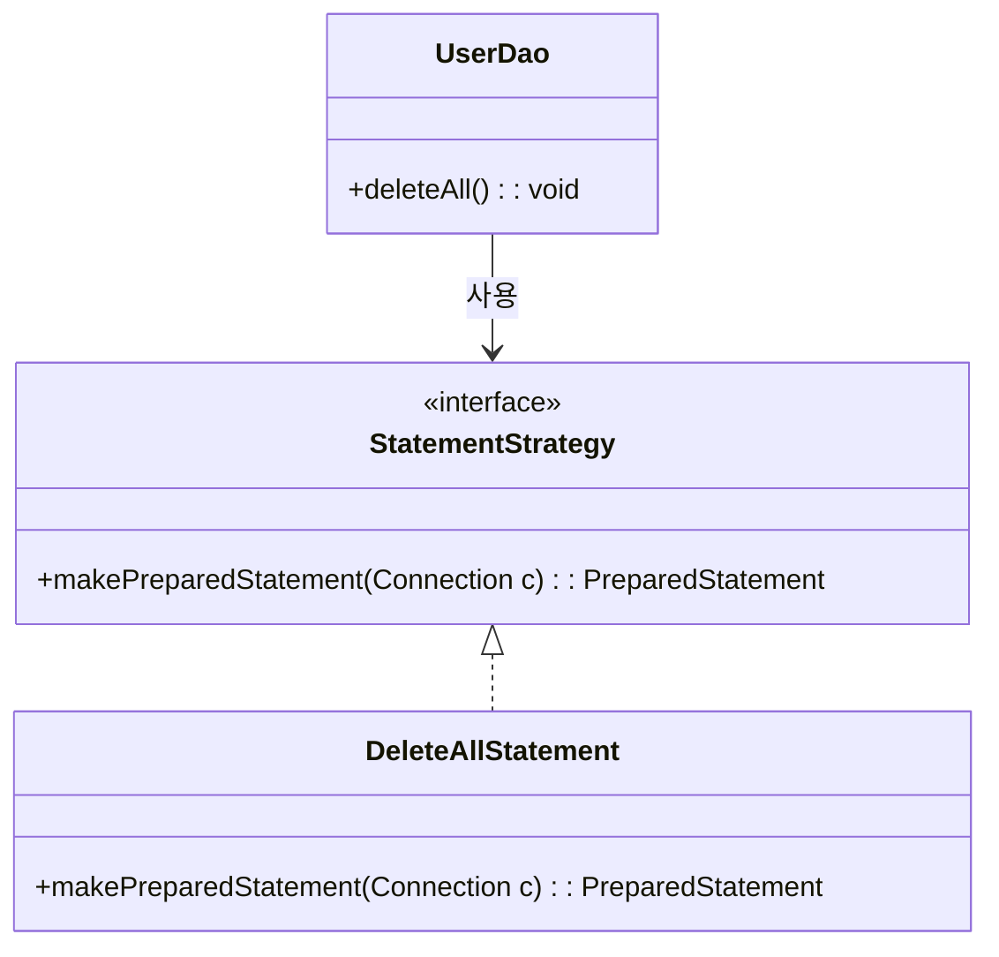

# 3장 테스트

> 템플릿/콜백 패턴을 통해 스프링의 객체지향 추구미를 이해하자

템플릿
- 코드에서 변화의 특성이 다른 부분을 구분하자 
- 코드에서 변화가 적은 부분을 독립시켜 각각 독립적으로 변경될 수 있는 효율적인 구조를 만드는 방법 

## 3.1 다시 보는 초난감 DAO

### 3.1.1 예외처리 기능을 갖춘 DAO 

사용 중인 공유 리소스
- `Connection`
- `PreparedStatement`

예외처리가 필요한 이유
- DB 커넥션은 재사용 가능한 풀로 관리되고 커넥션은 항상 명시적으로 반환해야 다시 공유 풀에 넣는다
- 메소드 중단 등으로 커넥션을 반환하지 못하면 리소스 부족 오류 발생
- 애플리케이션이 죽으면 다 반환됨

#### JDBC 조회 기능의 예외처리 

```java
public int getCount() throws SQLException {
    Connection c = null;
    PreparedStatement ps = null;
    ResultSet rs = null;

    try {
        c = dataSource.getConnection();
        ps = c.prepareStatement("select count(*) from users");

        rs = ps.executeQuery();
        rs.next();
        return rs.getInt(1);
    } catch (SQLException e) {
        throw e;
    } finally {
        if (rs != null) {
            try {
                rs.close();
            } catch (SQLException e) {
                // 예외 처리
            }
        }

        if (ps != null) {
            try {
                ps.close();
            } catch (SQLException e) {
                // 예외 처리
            }
        }

        if (c != null) {
            try {
                c.close();
            } catch (SQLException e) {
                // 예외 처리
            }
        }
    }
}
```

## 3.2 변하는 것과 변하지 않는 것 

### 3.2.1 JDBC try/catch/finally 코드의 문제점

문제점
1. try/catch/finally 2중 중첩
2. 메소드마다 중복 코드

### 3.2.2 분리와 재사용을 위한 디자인 패턴 적용

>  일단 PreparedStatement를 사용해서 변하는 부분을 나머지 코드에서 분리하면 변하지 않는 부분을 재사용할 수 있지 않을까?

#### 메소드 추출

문제점
- 분리시킨 메소드가 다른 곳에서 재사용되지 않고 확장되는 부분임
- 반대로 분리시키고 남은 부분이 재사용되는 부분임
```java
public void deleteAll() throws SQLException {
    Connection c = null;
    PreparedStatement ps = null;
    
    try {
        c = dataSource.getConnection();
        
        ps = makeStatement(c); // 변하는 부분을 메소드로 추출하여 호출
        ps.executeUpdate();
    } catch (SQLException e) {
        // 예외 처리
    } finally {
        // 자원 해제 처리 (Connection, PreparedStatement close)
    }
}

private PreparedStatement makeStatement(Connection c) throws SQLException {
    PreparedStatement ps;
    ps = c.prepareStatement("delete from users");
    return ps;
}
```

#### 템플릿 메소드 패턴의 적용

> 템플릿 메소드 패턴: 상속을 통해 기능을 확장한다

추상 클래스 UserDao, 추상 메소드 makeStatement() 
```java
import java.sql.Connection;
import java.sql.PreparedStatement;
import java.sql.SQLException;
import javax.sql.DataSource;

public abstract class UserDao {

    private DataSource dataSource;

    // DataSource 주입
    public void setDataSource(DataSource dataSource) {
        this.dataSource = dataSource;
    }

    // 템플릿 메서드 패턴 - 기본 흐름은 고정하고, 세부적인 PreparedStatement 생성은 서브 클래스에서 구현
    public void executeUpdate() throws SQLException {
        Connection c = null;
        PreparedStatement ps = null;

        try {
            // Connection 생성
            c = dataSource.getConnection();
            // 서브 클래스에서 구현한 makeStatement() 호출
            ps = makeStatement(c);
            // 쿼리 실행
            ps.executeUpdate();
        } catch (SQLException e) {
            throw e;
        } finally {
            // 자원 해제
            if (ps != null) {
                try {
                    ps.close();
                } catch (SQLException e) {
                    // 예외 처리
                }
            }
            if (c != null) {
                try {
                    c.close();
                } catch (SQLException e) {
                    // 예외 처리
                }
            }
        }
    }

    // PreparedStatement 생성을 위한 추상 메서드 (변하는 부분)
    abstract protected PreparedStatement makeStatement(Connection c) throws SQLException;
}
```

이를 상속하는 서브 클래스에서 메소드 구현 
```java
public class UserDaoDeleteAll extends UserDao {
    protected PreparedStatement makeStatement(Connection c) throws SQLException {
        PreparedStatement ps = c.prepareStatement("delete from users");
        return ps;
    }
}
```

장점
- UserDao 클래스의 기능을 상속을 통해 자유롭게 확장 가능
- 확장으로 인한 변화는 UserDao에 미치지 않음

문제점
- **DAO 로직마다 상속 클래스를 만들어야 한다!**


#### 전략 패턴의 적용

전략 패턴
- 확장에 해당하는 변하는 부분을 별도의 클래스로 만들어 추상화된 인터페이스를 통해 위임


deleteAll()의 컨텍스트
- DB 커넥션 가져오기	
- PreparedStatement를 만들어줄 외부 기능 호출하기	
- 전달받은 PreparedStatement 실행하기	
- 예외가 발생하면 이를 다시 메소드 밖으로 던지기	
- 모든 경우에 만들어진 PreparedStatement와 Connection을 적절히 닫아주기


StatementStrategy 인터페이스
```java
package springbook.user.dao;

public interface StatementStrategy {
    PreparedStatement makePreparedStatement(Connection c) throws SQLException;
}
```
deleteAll() 메소드의 기능을 구현한 StatementStrategy 전략 클래스 
```java
package springbook.user.dao;

public class DeleteAllStatement implements StatementStrategy {
    public PreparedStatement makePreparedStatement(Connection c) throws SQLException {
        PreparedStatement ps = c.prepareStatement("delete from users");
        return ps;
    }
}
```
전략 패턴에 따라 DeleteAllStatement가 적용된 deleteAll() 메소드 
```java
public void deleteAll() throws SQLException {
    Connection c = null;
    PreparedStatement ps = null;
    
    try {
        c = dataSource.getConnection();
        
        StatementStrategy strategy = new DeleteAllStatement(); // 🚨 컨텍스트가 특정 구현 클래스를 알고 고정되어 있음 
        ps = strategy.makePreparedStatement(c);

        ps.executeUpdate();
    } catch (SQLException e) {
        // 예외 처리
    } finally {
        // 자원 해제 처리 (Connection, PreparedStatement close)
    }
}
```

#### DI 적용을 위한 클라이언트/컨텍스트 분리

전략 패턴의 실제적인 사용법 

- 어떤 전략을 사용하게 할 것인가는 Context를 사용하는 앞단 Client가 결정하는 게 일반적
- like) 1장에서 UserDao가 필요로 하는 ConnectionMaker의 구현 클래스를 UserDaoTest라는 클라이언트가 만들어 제공해준 것 처럼 

ObjectFactory ~> DI
- 전략 오브젝트 생성과 컨텍스트로의 전달을 담당하는 책임을 분리하는 것
- 결국 DI는 전략 패턴을 일반적으로 사용할 수 있게 만드는 구조

> 마이크로 DI(수동 DI): DI의 가장 중요한 개념은 제 3자의 도움을 통해 두 오브젝트 사이의 관계를 유연하게 설정하는 것.
> 코드나 메소드 사이 같이 작은 단위에서도 일어날 수 있다.
> 이렇게 IoC 컨테이너의 도움 없이 코드 내에서 적용되는 것을 마이크로 DI, 또는 수동 DI(코드에 의한 DI)라고 부르기도 한다. 

## 3.3 JDBC 전략 패턴의 최적화

### 전략과 클라이언트의 동거

현재 구조의 문제점
- 먼저 DAO 메소드마다 새로운 StatementStrategy 구현 클래스를 만들어야 한다
- DAO 메소드에서 StatementStrategy에 전달할 User와 같은 부가적인 정보가 있는 경우, 이를 전달하고 저장해 둘 생성자와 인스턴스 변수를 번거롭게 만들어야 한다

#### 로컬 클래스 

StatementStrategy 전략 클래스를 매번 독립된 파일로 만들지 말고 UserDao 클래스 안에 내부 클래스로 정의해버리면 클래스 파일이 많아지는 문제는 해결할 수 있다.

```java
public void add(final User user) throws SQLException {
  class AddStatement implements StatementStrategy {   //  add() 메소드 내부에 선언된 로컬 클래
      User user;

      public AddStatement(User user) {
          this.user = user;
      }

      public PreparedStatement makePreparedStatement(Connection c) throws SQLException {
          PreparedStatement ps = c.prepareStatement("insert into users(id, name, password) values(?,?,?)");
          ...
      }

      StatementStrategy st = new AddStatement(user);
      jdbcContextWithStatementStrategy(st);
  }
}
```

장점
- AddStatement는 복잡한 클래스가 아니므로 메소드 안에서 정의해도 그다지 복잡해 보이지 않는다.
- 메소드마다 추가해야 했던 클래스 파일을 하나 줄일 수 있다.
- 내부 클래스의 특징을 이용해 로컬 변수를 바로 가져다 사용할 수 있다.

#### 익명 내부 클래스

> 클래스를 재사용할 필요가 없고, 구현한 인터페이스 타입으로만 사용할 경우 유용

익명 내부 클래스는 선언과 동시에 오브젝트를 생성한다.

```java
public void add(final User user) throws SQLException {
    jdbcContextWithStatementStrategy(
        new StatementStrategy() {
            public PreparedStatement makePreparedStatement(Connection c) throws SQLException {
                PreparedStatement ps = c.prepareStatement("insert into users(id, name, password) values(?,?,?)");
    
                ps.setString(1, user.getId());
                ps.setString(2, user.getName();
                ...
                return ps;
            }
        }
    );
}
```


## 3.4 컨텍스트와 DI

### 3.4.1 JdbcContext의 분리 

전략 패턴의 구조로 보자면 UserDao의 메소드가 클라이언트이고, 익명 내부 클래스로 만들어지는 것이 개별적인 전략이고, jdbcContextWithStatementStrategy() 메소드는 컨텍스트다. 
이 컨텍스트를 UserDao 클래스에서 독립시켴 모든 DAO가 사용하도록 리팩터링하자. 


```java
public class JdbcContext {
    private DataSource dataSource;

    public void setDataSource(DataSource dataSource) {  //  DataSource 타입 빈을 DI 받을 수 있게 준비해둔다
        this.dataSource = dataSource;
    }

    public void workWithStatementStrategy(StatementStrategy stmt) throws SQLException {
        Connection c = null;
        PreparedStatement ps = null;

        try {...} 
        catch (SQLException e) {...}
        finally {...}
    }
}
```
```java
public class UserDao {
    ...
    private JdbcContext jdbcContext;

    public void setJdbcContext(JdbcContext jdbcContext) {
        this.jdbcContext = jdbcContext;             //  jdbcContext를 Di받도록 만든다.
    }

    public void add(final User user) throws SQLException {
        this.jdbcContext.workWithStatementStrategy(     //  DI 받은 JdbcContext의 컨텍스트 메소드를 사용하도록 변경한다.
            new StatementStrategy() {...}
        );
    }
}
```

### 3.4.2 JdbcContext의 특별한 DI


#### 스프링 빈으로 DI

현재 UserDao와 JdbcContext 사이에는 인터페이스 없이 DI가 적용되어 있다. 
엄밀한 의미에서 인터페이스를 사용하지 않았다면 온전한 DI가 아니다. 
그러나 스프링 DI는 IoC라는 개념을 포괄하기 때문에 DI의 기본은 지켰다고 본다. 

그럼에도 JdbcContext를 UserDao와 DI 구조로 만들었을 때 이점
- JdbcContext가 스프링 컨테이너의 싱글톤 레지스트리에서 관리되는 싱글톤 빈이기 되기 때문
- JdbcContext가 DI를 통해 다른 빈에 의존하고 있기 때문

인터페이스를 사용하지 않은 이유
- 클래스로 구분되어 있으나 강한 응집도로 항상 같이 사용됨

## 3.5 템플릿과 콜백

> 전략 패턴의 기본 구조에 익명 내부 클래스를 활용한 방식을 스프링에서는 템플릿/콜백 패턴이라고 부른다.
> 전략 패턴의 컨텍스트를 템플릿이라 부르고, 익명 내부 클래스로 만들어지는 오브젝트를 콜백이라고 부른다.

콜백
- 파라미터로 전달되지만 값을 참조하기 위한 것이 아닌 특정 로직을 담은 메소드를 실행시키기 위함.
- `functional object`

### 3.5.1 템플릿/콜백의 동작 원리

#### 템플릿/콜백의 특징


- 클라이언트의 역할은 템플릿 안에서 실행될 로직을 담은 콜백 오브젝트를 만들고, 콜백이 참조할 정보를 제공하는 것이다. 만들어진 콜백은 클라이언트가 템플릿의 메소드를 호출할 때 파라미터로 전달된다.
- 템플릿은 정해진 작업 흐름을 따라 작업을 진행하다가 내부에서 생성한 참조정보를 가지고 콜백 오브젝트의 메소드를 호출한다. 콜백은 클라이언트 메소드에 있는 정보와 템플릿이 제공한 참조정보를 이용해서 작업을 수행하고 그 결과를 다시 템플릿에 돌려준다.
- 템플릿은 콜백이 돌려준 정보를 사용해서 작업을 마저 수행한다. 경우에 따라 최종 결과를 클라이언트에 다시 돌려주기도 한다.

#### JdbcContext에 적용된 템플릿/콜백 패턴


### 3.5.2 편리한 콜백의 재활용

#### 콜백의 분리와 재활용

복잡한 익명 내부 클래스 사용을 최소화 해보자

익명 내부 클래스를 사용한 클라이언트 코드
```java
public void deleteAll() throws SQLException {
    this.jdbcContext.workWithStatementStrategy(
        new StatementStrategy() {   //  변하지 않는 콜백 클래스 정의와 오브젝트 생성
            public PreparedStatement makePreparedStatement(Connection c) throws SQLException {
                return c.preparedStatement("delete from users");    //  변하는 SQL 문장
            }
        }
    );
}
```
변하지 않는 부분을 분리시킨 deleteAll() 메소드
```java
public void deleteAll() throws SQLException {
    executeSql("delete from users");
}
/// 분리
private void executeSql(final String query) throws SQLException {
    this.jdbcContext.workWithStatementStrategy(
        new StatementStrategy() {   //  변하지 않는 콜백 클래스 정의와 오브젝트 생성
            public PreparedStatement makePreparedStatement(Connection c) throws SQLException {
                return c.preparedStatement(query);
            }
        }
    );
}
```
sql을 담은 파라미터를 final로 선언하여 익명 내부 클래스인 콜백 안에서 직접 사용할 수 있게 하는 부분만 주의하면 된다.

#### 콜백과 템플릿의 결합


재사용 가능한 콜백을 담은 executeSql()을 DAO가 공유할 수 있는 템플릿 클래스로 이동
```java
public class JdbcContext {
    ...
    public void executeSql(final String query) throws SQLException {
        workWithStatementStrategy(
            new StatementStrategy() {
                public PreparedStatement makePreparedStatement(Connection c) 
                    throws SQLException {
                    return c.prepareStatement(query);
                }
            }
        );
    }
}
/// 분리 
public void deleteAll() throws SQLException {
    this.jdbcContext.executeSql("delete from users");
}
```

### 3.5.3 템플릿/콜백의 응용

#### 제네릭스를 이용한 콜백 인터페이스

타입 파라미터T를 이용하면 `LineCallback`과 `lineReadTemplate`가 파일의 라인을 처리해서 T 타입의 결과를 만들어내는 범용적인 템플릿/콜백이 된다 

```java
package springbook.learningtest.template;

public interface LineCallback<T> {
    T doSomethingWithLine(String line, T value);
}
```
```java
public <T> T lineReadTemplate(String filepath, LineCallback<T> callback, T initVal) throws IOException {
    BufferedReader br = null;
    try {
        br = new BufferedReader(new FileReader(filepath));
        T res = initVal;
        String line = null;
        while((line = br.readLine()) != null) {
            res = callback.doSomethingWithLine(line, res);
        }
        return res;
    } catch(IOException e) {
        System.out.println(e.getMessage());
        throw e;
    } finally {
        if (br != null) {
            try { br.close(); } catch(IOException e) { System.out.println(e.getMessage()); }
        }
    }
}
```

## 3.6 스프링의 JdbcTemplate

JdbcTemplate
- 자주 사용되는 패턴을 가진 콜백은 다시 템플릿에 결합시켜 간단한 메소드 호출만으로 사용 가능
- DataSource를 DI 받아서 JdbcTemplate 수성자로 주입해서 초기화 

```java
public class UserDao {
	private DataSource dataSource;
	private JdbcTemplate jdbcTemplate;
		
	public void setDataSource(DataSource dataSource) {
		this.jdbcTemplate = new JdbcTemplate(dataSource);
		this.dataSource = dataSource;
	}
```

### 3.6.1 update()

deleteAll()을 리팩터링 
```java
// 템플릿 메소드 적용
public void deleteAll() {
    this.jdbcTemplate.update(
        new PreparedStatementCreator() {
            public PreparedStatement createPreparedStatement(Connection con)
                throws SQLException {
                return con.prepareStatement("delete from users");
            }
        }
    );
}
// 메소드 사용 
public void deleteAll() throws SQLException {
		this.jdbcTemplate.update("delete from users");
}
```

### 3.6.2 queryForInt()

getCount()
```java
// 2중 콜백 적용
public int getCount() {
    return this.jdbcTemplate.query(
        new PreparedStatementCreator() {
            public PreparedStatement createPreparedStatement(Connection con) 
                throws SQLException {
                return con.prepareStatement("select count(*) from users");
            }
        }, 
        new ResultSetExtractor<Integer>() { // 제네릭스 타입 
            public Integer extractData(ResultSet rs) throws SQLException, 
                DataAccessException {
                rs.next();
                return rs.getInt(1);
            }
        });
}
// 메소드 사용 
public int getCount() {
		return this.jdbcTemplate.queryForInt("select count(*) from users");
	}
```

### 3.6.3 queryForObject()

get()
```java
public User get(String id) {
  return this.jdbcTemplate.queryForObject("select * from users where id = ?",
      new Object[] {id}, 
      new RowMapper<User>() {
        public User mapRow(ResultSet rs, int rowNum)
            throws SQLException {
          User user = new User();
          user.setId(rs.getString("id"));
          user.setName(rs.getString("name"));
          user.setPassword(rs.getString("password"));
          return user;
        }
      });
}
```

### 3.6.4 query()

#### 기능 정의와 테스트 작성

getAll() 테스트
- RowMapper에 대한 학습 테스트
```java
@Test
public void getAll()  {
  dao.add(user1); // Id: gyumee
  List<User> users1 = dao.getAll();
  assertThat(users1.size(), is(1));
  checkSameUser(user1, users1.get(0));
  
  dao.add(user2); // Id: leegw700
  List<User> users2 = dao.getAll();
  assertThat(users2.size(), is(2));
  checkSameUser(user1, users2.get(0));  
  checkSameUser(user2, users2.get(1));
  
  dao.add(user3); // Id: bumjin
  List<User> users3 = dao.getAll();
  assertThat(users3.size(), is(3));
  checkSameUser(user3, users3.get(0));  
  checkSameUser(user1, users3.get(1));  
  checkSameUser(user2, users3.get(2));  
}

private void checkSameUser(User user1, User user2) {
  assertThat(user1.getId(), is(user2.getId()));
  assertThat(user1.getName(), is(user2.getName()));
  assertThat(user1.getPassword(), is(user2.getPassword()));
}
```

#### query() 템플릿을 이용하는 getAll() 구현

```java
public List<User> getAll() {
  return this.jdbcTemplate.query("select * from users order by id",
      new RowMapper<User>() {
        public User mapRow(ResultSet rs, int rowNum)
            throws SQLException {
          User user = new User();
          user.setId(rs.getString("id"));
          user.setName(rs.getString("name"));
          user.setPassword(rs.getString("password"));
          return user;
        }
      });
}
```

#### 테스트 보완

예외상황에 대한 테스트(네거티브 테스트) 
```java
@Test
public void getAll()  {
  dao.deleteAll();
		
  List<User> users0 = dao.getAll();
  assertThat(users0.size(), is(0)); // -> 데이터가 없는 경우에 대한 검증
  ...
}
```

이런 테스트가 갖는 의미
- JdbcTemplate query()를 사용하든 직접 만들어 쿼리를 날리든 getAll()이 어떻게 동작하는지만 알면 된다
- 따라서 getAll()의 예상 가능한 모든 동작을 검증하는게 옳다
- 추후 구현이 바뀌어도 UserDao가 동일한 기능을 유지함을 보장할 수 있다 

### 3.6.5 재사용 가능한 콜백의 분리

#### DI를 위한 코드 정리

- DataSource는 직접 사용하지 않으므로 인스턴스 변수로 남길 필요 없다
- 다만 JdbcTemplate가 DI 받기 위해 전닯 받으려면 수정자에는 남겨둬야 한다
- 이렇게 setDatSource라느 이름의 수정자인데 다른 오브젝트를 생성하는 경우도 있다
- JdbcTemplate를 직접 스프링 빈으로 등록하여 사용할 수도 있다
  - 수정자 메서드 `setDataSource` -> `setJdbcTemplate` 변경

```java
public class UserDao {
	private JdbcTemplate jdbcTemplate;
		
	public void setDataSource(DataSource dataSource) {
		this.jdbcTemplate = new JdbcTemplate(dataSource);
	}
```

#### 중복 제거

```java
private RowMapper<User> userMapper = 
  new RowMapper<User>() {
      public User mapRow(ResultSet rs, int rowNum) throws SQLException {
      User user = new User();
      user.setId(rs.getString("id"));
      user.setName(rs.getString("name"));
      user.setPassword(rs.getString("password"));
      return user;
    }
  };
```

```java
public User get(String id) {
  return this.jdbcTemplate.queryForObject("select * from users where id = ?",
      new Object[] {id}, this.userMapper);
}
public List<User> getAll() {
  return this.jdbcTemplate.query("select * from users order by id",this.userMapper);
}
```

#### 템플릿/콜백 패턴과 UserDao

[최종 UserDao 클래스 소스코드](https://github.com/AcornPublishing/toby-spring3-1/blob/main/Vol1-31/Ch3/3.final/src/springbook/user/dao/UserDao.java)

UserDao에 있는 것
- User 오브젝트와 USER 테이블이 어떻게 정보를 주고받을 것인가
- DB와 커뮤니케이션 하기 위한 SQL 문장

JdbcTemplate에 책임⋅관심을 위임한 것 
- JDBC API를 사용하는 방식
- 예외처리
- 리소스 반납
- DB 연결 가져오는 방법

JdbcTemplate이라는 템플릿 클래스를 직접 이용한다는 면에서 강결합으로 볼 수 도 있음
- JdbcTemplate를 빈으로 등록하고
- JdbcOperations 인터페이스를 통해 DI 받아 사용해도 된다
- 하지만 현재는 JdbcTemplate를 DAO안에 직접 만들어 사용하는게 관례

UserDao에 변경 가능한 부분
- UserMapper를 독립된 빈으로 만들고 XML 설정에 USER 테이블의 필드 이름과 User 오브젝트 프로퍼티 매핑 정보 분리 
- SQL 문장을 외부 리소스에 분리하면 SQL 쿼리 최적화 시 UserDao 코드를 변경하지 않고 모든 SQL 쿼리를 DBA가 생성⋅관리
  - .sql을 사용하거나 약간의 설정을 통해 .yaml에 한번에 쿼리 관리도 가능할 것

## 기억에 남는 내용 

> 💡 클래스 이름이 Template로 끝나거나 인터페이스 이름이 Callback으로 끝난다면 템플릿/콜백이 적용된 것

### Java의 Generics 

#### 의미
제네릭스(Generics)는 클래스나 메소드에서 사용할 데이터 타입을 미리 지정하지 않고, 나중에 구체적인 타입을 지정할 수 있도록 하는 기능입니다. 컴파일 타임에 타입을 체크하여 타입 안정성을 제공합니다. 다양한 타입을 다루는 코드를 재사용할 수 있게 해줍니다.

#### 목적
컴파일 시 타입 안정성을 보장하고, 코드의 중복을 줄이며 재사용성을 높이는 것이 목적입니다. 타입 캐스팅 없이 객체를 안전하게 다룰 수 있도록 설계되었습니다. 다양한 데이터 타입을 처리하는 코드를 하나로 통합하기 위해 사용됩니다.

#### 기본 사용법 
- 제네릭 타입은 클래스나 메소드 선언에서 `<T>` 와 같은 형식으로 선언한다. 
- ex) `List<T>`는 어떤 타입의 객체든 담을 수 있는 리스트가 된다. 사용 시 `List<String>`처럼 실제 타입을 지정하면 그 타입으로만 리스트가 사용된다. 

#### 장점
1. 컴파일 시점에 타입 검사를 통해 오류를 예방할 수 있습니다.  
2. 타입 캐스팅이 불필요하여 코드가 간결해지고 가독성이 높아집니다.  
3. 다양한 타입을 처리하는 코드의 중복을 줄이고, 재사용성을 높입니다.

### 제한사항 
1. 기본 타입(int, float 등)은 제네릭 타입으로 사용할 수 없고, 래퍼 클래스(Integer, Float 등)로만 사용 가능합니다.  
2. 런타임에는 제네릭 타입 정보가 소거(타입 소거)되어 실제 타입을 알 수 없습니다.  
3. 배열은 제네릭 타입을 사용할 수 없습니다 (`new T[]`와 같은 구문은 허용되지 않음).


