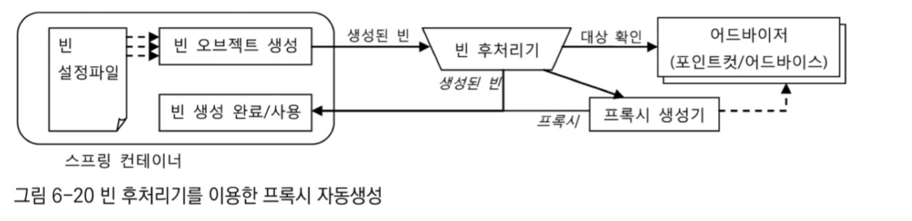

# 6.4 스프링의 프록시 팩토리 빈
스프링은 프록시 오브젝트를 생성해주는 기술을 추상화한 팩토리 빈을 제공한다.
## 6.4.1 ProxyFactoryBean
프록시를 생성해서 빈 오브젝트로 등록하게 해주는 팩토리 빈
순수하게 프록시를 생성하는 작업만 담당
프록시를 통해 제공해줄 부가기능은 별도의 빈으로 둘 수 있다.
ProxyFactoryBean이 생성하는 프록시에서 사용할 부가기능은 MethodInterceptor 인터페이스를 구현해 만든다.
- InvocationHandler의 invoke() 메서드는 타깃 오브젝트에 대한 정보를 제공하지 않음
    - 타깃은 InvocationHandler를 구현한 클래스를 직접 알아야 함
- MethodInterceptor의 invoke() 메서드는 ProxyFactoryBean으로부터 타깃 오브젝트의 정보까지 제공받음
    - 타깃이 다른 여러 프록시에 함께 사용 가능 + 싱글톤 빈으로 등록 가능

`스프링 proxyfactorybean 을 이용한 다이내믹 프록시 테스트`
```java
package springbook.learningtest.jdk.proxy;

import org.junit.jupiter.api.Test;
import org.springframework.aop.framework.ProxyFactoryBean;
import org.springframework.aop.MethodBeforeAdvice;
import org.springframework.aop.framework.ProxyFactory;
import org.aopalliance.intercept.MethodInterceptor;
import org.aopalliance.intercept.MethodInvocation;

import java.lang.reflect.Proxy;

import static org.hamcrest.MatcherAssert.assertThat;
import static org.hamcrest.Matchers.is;

public class DynamicProxyTest {

    @Test
    public void simpleProxy() {
        // JDK 다이내믹 프록시 생성
        Hello proxiedHello = (Hello) Proxy.newProxyInstance(
            getClass().getClassLoader(),
            new Class[]{Hello.class},
            new UppercaseHandler(new HelloTarget())
        );

        assertThat(proxiedHello.sayHello("Toby"), is("HELLO TOBY"));
        assertThat(proxiedHello.sayHi("Toby"), is("HI TOBY"));
        assertThat(proxiedHello.sayThankYou("Toby"), is("THANK YOU TOBY"));
    }

    @Test
    public void proxyFactoryBean() {
        ProxyFactoryBean pfBean = new ProxyFactoryBean();
        pfBean.setTarget(new HelloTarget()); // 타깃 설정
        pfBean.addAdvice(new UppercaseAdvice()); // 부가기능을 담은 어드바이스 추가

        Hello proxiedHello = (Hello) pfBean.getObject(); // FactoryBean이므로 getObject()로 생성된 프록시를 가져옴
        assertThat(proxiedHello.sayHello("Toby"), is("HELLO TOBY"));
        assertThat(proxiedHello.sayHi("Toby"), is("HI TOBY"));
        assertThat(proxiedHello.sayThankYou("Toby"), is("THANK YOU TOBY"));
    }

    static class UppercaseAdvice implements MethodInterceptor {
        public Object invoke(MethodInvocation invocation) throws Throwable {
            String ret = (String) invocation.proceed(); // 리플렉션의 Method와 달리 메소드 실행 시 타깃 오브젝트를 전달할 필요x
            return ret.toUpperCase(); // 부가기능 적용
        }
    }

    // 타깃과 프록시가 구현할 인터페이스
    static interface Hello {
        String sayHello(String name);
        String sayHi(String name);
        String sayThankYou(String name);
    }

    static class HelloTarget implements Hello {
        public String sayHello(String name) {
            return "Hello " + name;
        }

        public String sayHi(String name) {
            return "Hi " + name;
        }

        public String sayThankYou(String name) {
            return "Thank You " + name;
        }
    }
}
```

**스프링의 ProxyFactoryBean의 방식**
두 가지 확장 기능인 부가기능(Advice)과 메소드 선정 알고리즘(Pointcut)을 활용하는 유연한 구조 제공
어드바이스와 포인트컷 모두 프록시에 DI 로 주입돼서 사용
두 가지 모두 여러 프록시에 공유 가능하도록 만들어져서 스프링의 싱글톤 빈으로 등록 가능

> `어드바이스 (Advice)`
>> MethodInterceptor처럼 타깃 오브젝트에 적용하는 부가기능을 담은 오브젝트
>> 타깃 오브젝트에 종속되지 않는 순수한 부가기능을 담은 오브젝트
>> MethodHandler가 템플릿 MethodInvocation 이 콜백백

> `포인트컷(Pointcut)`
>> 메소드 선정 알고리즘을 담은 오브젝트
>> 어떤 메소드에 어드바이스를 적용할지 결정하는 방법


1. 프록시는 클라이언트로부터 요청을 받으면 먼저 포인트컷에게 부가기능을 부여할 메소드인지 확인해달라 요청
2. 프록시는 포인트컷으로부터 부가기능을 적용할 대상 메소드인지 확인 받으면 MethodInterceptor 타입의 어드바이스를 호출
3. 어드바이스가 부가기능을 부여하는 중에 타깃 메소드의 호출이 필요하면 프록시로부터 전달받은 MethodInvocation타입 콜백 오브젝트의 proceed()메소드를 호출해주기만 하면 된다.

어드바이스가 일종의 템플릿이 되고 타깃을 호출하는 기능을 갖고 있는 MethodInvocation 오브젝트가 콜백이 된다.
템플릿은 한 번 만들면 재사용이 가능하고 여러 빈이 공유해서 사용할 수 있다.
어드바이스도 독립적인 싱글톤 빈으로 등록하고 DI 를 주입해 여러 프록시가 사용하도록 만들 수 있다.

프록시로부터 어드바이스와 포인트컷을 독립시키고 DI를 사용하게 한 것 → 전략 패턴 구조, OCP를 충실히 지키는 구조

`포인트컷까지 적용한 proxyfactorybean`
```java
@Test

public void pointcutAdvisor() {

ProxyFactoryBean pfBean = new ProxyFactoryBean();

pfBean.setTarget(new HelloTarget());

NameMatchMethodPointcut pointcut = new NameMatchMethodPointcut(); // 메소드 이름을 비교해 대상 선정하는 알고리즘을 제공하는 포인트컷 생성

pointcut.setMappedName("sayH*"); // 이름 비교조건 설정

// 포인트컷과 어드바이스를 Advisor로 묶어서 한 번에 추가

pfBean.addAdvisor(new DefaultPointcutAdvisor(pointcut, new UppercaseAdvice()));

Hello proxiedHello = (Hello) pfBean.getObject();

assertThat(proxiedHello.sayHello("Toby"), is("HELLO TOBY"));

assertThat(proxiedHello.sayHi("Toby"), is("HI TOBY"));

assertThat(proxiedHello.sayThankYou("Toby"), is("Thank You TOBY")); // 메소드 이름이 포인트컷의 선정조건에 맞지 않으므로, 부가기능(대문자변환)이 적용 x

}
```
Q) 어드바이스를 등록하듯이 포인트컷도 그냥 추가하면 될 것을 왜 굳이 별개의 오브젝트로 묶어서 등록해야 할까? (어드바이스와 포인트컷을 Advisor 타입으로 묶어서 addAdvisor() 메소드 호출)
A) ProxyFactoryBean에는 여러 개의 어드바이스와 포인트컷이 추가될 수 있음

> `어드바이저 (Advisor)`
>> 어드바이스와 포인트컷을 묶은 오브젝트
>> 어드바이저 = 포인트컷 (메소드 선정 알고리즘) + 어드바이스 (부가기능)

## 6.4.2 ProxyFactoryBean 적용
### TransactionAdvice
부가기능을 담당하는 어드바이스는 테스트에서 만들어본 것처럼  MethodInterceptor 라는 Advice 서브인터페이스를 구현해서 만든다.
`트랜잭션 어드바이스`
```java
package springbook.user.service;

import org.aopalliance.intercept.MethodInterceptor;
import org.aopalliance.intercept.MethodInvocation;
import org.springframework.transaction.PlatformTransactionManager;
import org.springframework.transaction.TransactionStatus;
import org.springframework.transaction.support.DefaultTransactionDefinition;

public class TransactionAdvice implements MethodInterceptor { // 스프링의 어드바이스 인터페이스 구현
    PlatformTransactionManager transactionManager;

    public void setTransactionManager(PlatformTransactionManager transactionManager) {
        this.transactionManager = transactionManager;
    }

    // 타깃을 호출하는 기능을 가진 콜백 오브젝트를 프록시로부터 받음(어드바이스는 특정 타깃에 의존하지 않고 재사용 가능)
    public Object invoke(MethodInvocation invocation) throws Throwable {
        TransactionStatus status = this.transactionManager.getTransaction(new DefaultTransactionDefinition());

        try {
            Object ret = invocation.proceed(); // 콜백 호출해 타깃의 메소드 실행
            this.transactionManager.commit(status);
            return ret;
        } catch (RuntimeException e) { // 예외가 포장되지 않고 타깃에서 보낸 그대로 전달됨
            this.transactionManager.rollback(status);
            throw e;
        }
    }
}
```


### 어드바이스와 포인트컷 재사용
- ProxyFactoryBean은 스프링의 DI와 템플릿/콜백 패턴, 서비스 추상화 등의 기법이 모두 적용된 것
- 독립적이며 여러 프록시가 공유할 수 있는 어드바이스와 포인트컷으로 확장 기능을 분리할 수 있음
- 새로운 비지니스 로직을 담은 서비스 클래스가 만들어져도 이미 만들어둔 trasactionAdvice를 그대로 재사용 가능
- 메소드 선정을 위한 포인트컷이 필요하며 이름 패턴만 지정해서 ProxyFactoryBean 에 등록해주면 된다.
  

# 6.5 스프링 AOP
## 6.5.1 자동 프록시 생성
프록시 팩토리 빈 방식의 접근 방법의 한계 해결
1. ~~부가기능이 타깃 오브젝트마다 새로 만들어지는 문제 → 스프링 proxyfactorybean 의 어드바이스 로 해결완료!~~
2. 부가기능의 적용이 필요한 타깃 오브젝트마다 거의 비슷한 내용의 proxyfactorybean 빈 설정정보를 추가하는 것
### 빈 후처리기를 이용한 자동 프록시 생성기

DefaultAdvisorAutoProxyCreator 빈 후처리기가 등록되어 있으면 스프링은 빈 오브젝트를 만들 때마다 후처리기에게 빈을 보낸다.

DefaultAdvisorAutoProxyCreator은 어드바이저를 이용한 자동 프록시 생성기이다.

1. 스프링은 빈 오브젝트를 만들 때마다 후처리기에게 빈을 보낸다.
2. 포인트컷을 이용해 전달받은 빈이 프록시 적용 대상인지 확인하고
3. 적용 대상이면 내장된 프록시 생성기에게 현재 빈에 대한 프록시를 만들게한다.
4. 이렇게 만들어진 프록시에 어드바이저를 연결한다.
5. 프록시 생성이 완료되면 프록시 오브젝트를 컨테이너에게 돌려준다.
6. 컨테이너는 최종적으로 빈 후처리기가 돌려준 오브젝트를 빈으로 등록하고 사용한다.

→ 빈 후처리기를 사용하면 일일이 빈을 등록하지 않아도 타깃 오브젝트에 자동으로 프록시가 적용되게 할 수 있다.

### 확장된 포인트컷
`두가지 기능을 정의한 pointcut 인터페이스`
```java
public interface Pointcut {
//프록시를 적용할 클래스인지 확인
ClassFilter getClassFilter();
//어드바이스를 적용할 메소드인지 확인
MethodMatcher getMethodMatcher();
}
```
1. 포인트컷이 등록된 빈 중에서 어떤 빈을 프록시에 먼저 적용할지 선택하는 역할
2. 어떤 메소드에 부가기능을 적용할지 선정하는 역할

pointcut 선정 기능을 모두 적용하면
1. 먼저 프록시를 적용할 클래스인지 판단
2. 적용 대상 클래스인 경우 어드바이스를 적용할 메소드인지 확인

이 두 조건이 모두 충족되는 타깃의 메소드에 어드바이스가 적용된다.
## 6.5.2 DefaultAdvisorAutoProxyCreator 적용
### 테스트 필터를 적용한 포인트컷 작성
메소드 이름만 비교하던 포인트컷인 NameMatchMethodPointcut을 상속해서 프로퍼티로 주어진 이름 패턴을 가지고 클래스 이름을 비교하는 ClassFilter를 추가하도록 만들 것이다.

`클래스 필터가 포함된 포인트컷`
```java
import org.springframework.aop.ClassFilter;
import org.springframework.aop.support.NameMatchMethodPointcut;

public class NameMatchClassMethodPointcut extends NameMatchMethodPointcut {

    public void setMappedClassName(String mappedClassName) {
        this.setClassFilter(new SimpleClassFilter(mappedClassName));
    }

    // 내부 클래스로 간단한 클래스 필터 구현
    static class SimpleClassFilter implements ClassFilter {
        private String mappedClassName;

        public SimpleClassFilter(String mappedClassName) {
            this.mappedClassName = mappedClassName;
        }

        @Override
        public boolean matches(Class<?> clazz) {
            // 와일드카드 '*' 지원
            return clazz.getSimpleName().equals(mappedClassName) ||
                   clazz.getSimpleName().matches(mappedClassName.replace("*", ".*"));
        }
    }
}

```
### 자동생성 프록시 확인
지금까지 트랜잭션 어드바이스를 적용한 프록시 자동생성기를 빈 후처리기 메커니즘을 통해 적용했다.
우리는 최소한 두가지는 확인해야 한다.
1. 트랜잭션이 필요한 비넹 트랜잭션 부가기능이 적용됐는가
   upgradeAllOrNothing() 통해 검증
2. 아무 빈에나 트랜잭션이 부가기능이 적용된 것은 아닌지 확인
   클래스  필터가 제대로 동작해서 프록시 생성 대상을 선별하고 있는지 여부를 확인하고 싶은 것
    - 포인트컷의 클래스 필터를 통해 확인
    - 포인트컷 빈의 클래스 이름 패턴을 변경해서 오류 나는지 확인

### 포인트컷 표현식을 이용한 포인트컷
**복잡하고 세밀한 기준을 이용해 클래스나 메소드를 선정하게 하려면?**
포인트컷 표현식을 사용해보자.
> 포인트컷 표현식
>> 정규식이나 JSP의 EL 과 비슷한 일종의 표현식 언어를 사용해서 포인트컷을 작성할 수 있도록 한 것

### 포인트컷 표현식
AspectJExpressionPointcut 클래스를 사용해서 표현식을 사용하면 된다.
AspectJExpressionPointcut은 클래스와 메소드의 선정 알고리즘을 표현식을 이용해 한 번에 지정할 수 있게 해준다. 정규식과 같은 간단한 문자열로 복잡한 선정조건을 만드는 것이다.

*→ AspectJ라는 유명한 프레임워크에서 제공하는 것을 가져와 일부 문법을 확장해서 써서 AspectJ 포인트컷 표현식이라고도 한다.*

### 포인트컷 표현식 문법

포인트컷 지시자 중 가장 대표적으로 사용되는 것이 execution()이다.

### 타입 패턴과 클래스 이름 패턴
포인트컷 표현식을 사용하기 전에는 클래스 이름의 패턴을 이용해 타깃 빈을 선정하는 포인트컷을 사용했지만 포인트컷 표현식에서는 클래스 이름에 적용되는 패턴은 클래스 이름 패턴이 아니라 **타입 패턴**이다. 그래서 TestUserService클래스를 돌려도 성공하는 것이다.

## 6.5.4 AOP란?
### 트랜잭션 서비스 추상화
인터페이스와 DI를 통해 분리하는 과정
무엇을 남기고, 그것을 어떻게 하는지 분리하는 것에서 고려할 부분은 더 이상 비지니스 로직 코드에 영향을 주지 않고 독립적으로 변경할 수 있도록 하는 것이다.

### 프록시와 데코레이터 패턴
클라이언트가 인터페이스와 DI를 통해 접근하도록 설계하고, 데코레이터 패턴을 적용해서 비지니스 로직을 담은 클래스의 코드에는 전혀 영향을 주지 않으면서 트랜잭션이라는 부가적인 기능을 자유롭게 부여할 수 있는 구조를 만들었다.

### 다이내믹 프록시와 프록시 팩토리 빈
프록시 클래스를 만드는 작업이 큰 짐이 되었다.
그래서 JDK 다이내믹 프록시를 이용해 프록시 클래스 없이도 프록시 오브젝트를 만들었다.

### 자동 프록시 생성 방법과 포인트컷
클래스와 메소드 선정 로직을 담은 코드를 직접 만들어서 포인트컷으로 사용했지만 최종적으로 포인트컷 표현식이라는 더 편리하고 깔끔한 방법을 활용해 간단한 설정만으로 적용 대상을 손쉽게 선택할 수 있게 만들었다.

### 부가기능의 모듈화
트랜잭션 같은 부가기능은 핵심기능과 같은 방식으로 모듈화하기 매우 힘들다.
이름 그대로 부가기능이기 때문에 스스로는 독립적인 방식으로 존재해서는 적용되기 어렵기 때문이다.

어드바이저와 같은 방법으로 모듈을 만들어서 사용한다.

### AOP: 애스펙트 지향 프로그래밍
애스팩트란 애플리케이션을 구성하는 중요한 한 가지 요소이고, 핵심기능에 부가되어 의미를 갖는 특별한 모듈을 가리킨다.

애스팩트는 부가될 기능을 정의한 코드인 어드바이스와 어드바이스를 어디에 적용할지를 결정하는 포인트컷을 함께 갖고 있다.
지금 사용하는 어드바이저는 아주 단순한 형태인 애스팩트라고 볼 수 있다.

## 6.5.5 AOP 적용기술
### 프록시를 이용한 AOP
프록시로 만들어서 DI로 연결된 빈 사이에 적용해 타깃의 메소드 호출 과정에 참여해 부가기능을 제공해주도록 만들었다.
독립적으로 개발한 부가기능 모듈을 다양한 타깃 오브젝트의 메소드에 다이내믹하게 적용해주기 위해 가장 중요한 역할을 하는게 프록시이다.
그래서 스프링 AOP 는 프록시 방식의 AOP 라고 할 수 있다.

### 바이트코드 생성과 조작을 통한 AOP
AspectJ는 프록시를 사용하지 않는 대표적인 AOP 기술이다.

AspectJ는 프록시처럼 간접적인 방법이 아니라 타깃 오브젝트를 뜯어고쳐서 부가기능을 직접 넣어주는 직접적인 방법을 사용한다.
왜? AspectJ는 프록시 같은 방법이 있음에도 복잡한 방법을 사용할까?
1. 바이트코드를 조작해서 타깃 오브젝트를 직접 수정해버리면 스프링과 같은 DI 컨테이너의 도움을 받아서 자동 프록시 생성방식을 사용하지 않아도 AOP를 적용할 수 있기 때문이다.
2. 프록시 방식보다 훨씬 강력하고 유연한 AOP가 가능하다.
## 6.5.6 AOP 용어
1. 타깃
   부가기능을 부여할 대상
   핵심기능을 담은 클래스일 수도 있지만 경우에 따라서 다른 부가기능을 제고하는 프록시 오브젝트일 수 있다.
2. 어드바이스
   타깃에게 제공할 부가기능을 담은 모듈
   오브젝트로 정의하기도 하지만 메소드 레벨에서 정의할 수 있다.
3. 조인 포인트
   어드바이스가 적용될 수 있는 위치
   스프링의 프록시 AOP 에서 조인 포인트는 메소드의 실행 단계뿐이다.
   타깃 오브젝트가 구현한 인터페이스의 모든 메소드는 조인포인트가 된다.
4. 포인트컷
   어드바이스를 적용할 조인 포인트를 선별하는 작업 또는 그 기능을 정의한 모듈
   메소드를 선정하는 기능을 갖는다.
5. 프록시
   클라이언트와 타깃 사이에 투명하게 존재하면서 부가기능을 제공하는 오브젝트
6. 어드바이저
   포인트컷과 어드바이스를 하나씩 갖고 있는 오브젝트
   어떤 부가기능(어드바이스)을 어디에(포인트컷) 전달할 것인가를 알고 있는 AOP의 가장 기본 모듈이다.
7. 애스펙트
   OOP의 클래스와 마찬가지로 애스펙트는 AOP 의 기본 모듈
   클래스와 같은 모듈의 정의와 오브젝트와 같은 실체의 구분이 특별히 없다.
