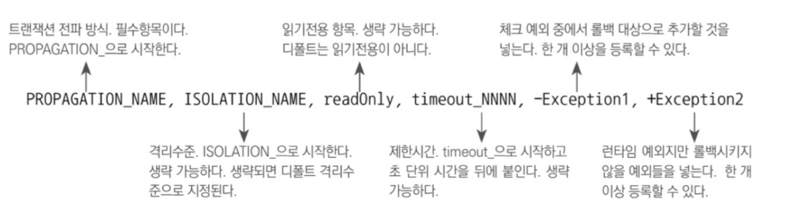
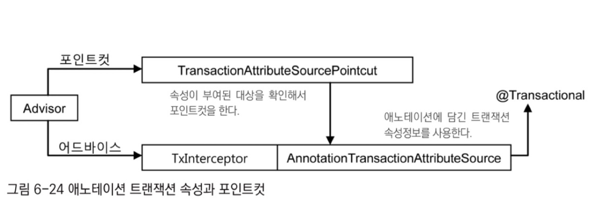

# 트랜잭션 속성

## 트랜잭션 정의

DefaultTransactionDefinition이 구현하고 있는 TransactionDefinition 인터페이스는 트랜잭션 동작방식에 영향을 줄 수 있는 4가지 속성을 갖고 있다.
### 트랜잭션 전파

트랜잭션의 경계에서 이미 진행 중인 트랜잭션이 있을 때 또는 없을 때 어떻게 동작할 것인가를 결정하는 방식이다.

- **PROPAGATION_REQUIRED**
  가장 많이 사용되는 전파 속성
  진행 중인 트랜잭션이 없으면 새로 시작하고, 이미 시작된 트랜잭션이 있으면 이에 참여한다.
- **PROPAGATION_REQUIRES_NEW**
  항상 새로운 트랜잭션을 시작한다.
  독립적인 트랜잭션이 보장돼야 하는 코드에 적용
- **PROPAGATION_NOT_SUPPORTED**
  트랜잭션 없이 동작하도록 만들 수 있다.

### 격리수준

모든 DB 트랜잭션은 격리수준을 가져야 한다.
적절하게 격리수준을 조정해서 가능한 한 많은 트랜잭션을 동시에 진행시키면서도 문제가 발생하지 않게 하는 제어가 필요

### 제한시간

트랜잭션을 수행하는 제한시간을 설정할 수 있다.
제한시간은 트랜잭션을 직접 시작할 수 있는 PROPAGATION_REQUIRED나PROPAGATION_REQUIRE_NEW와 함께 사용해야 의미가 있다.

### 읽기전용

읽기전용으로 해두면 트랜잭션 내에서 데이터를 조작하는 시도를 막아줄 수 있다.
데이터 액세스 기술에 따라서 성능 향상도 된다.

## 트랜잭션 인터셉터와 트랜잭션 속성

## 트랜잭션 인터셉터

기존에 만들었던 TransactionAdvice를 다시 설계할 필요가 없다.
TransactionInterceptor 어드바이스의 동작방식은 기존에 만들었던 TransactionAdvice와 다르지 않다.
TransactionInterceptor은 PlatformTransactionManager와 Properties 타입의 두가지 프로퍼티를 갖고 있다.
Properties 타입인 두 번째 프로퍼티 이름은 transactionAttributes로 트랜잭션 속성을 정의한 프로퍼티다.

스프링이 제공하는 TransactionInterceptor에는 기본적으로 두 가지 종류의 예외 처리 방식이 있다.
런타임 예외가 발생하면 롤백되고 체크 예외가 발생하면 이를 의미 있는 리턴 방식으로 인지해서 커밋시킨다.
transactionAttributes는 rollbackOn()이라는 속성을 둬서 기본 원칙과 다른 예외처리가 가능하게 해준다. → 특정 체크 예외의 경우는 트랜잭션을 롤백시키고, 특정 런타임 예외에 대해서는 트랜잭션을 커밋시킬 수 있다.

### 메소드 이름 패턴을 이용한 트랜잭션 속성 지정

Properties 타입의 transactionAttributes 프로퍼티는 메소드 패턴과 트랜잭션 속성을 키와 값으로 갖는 컬렉션이다.



이 중에서 트랜잭션 전파 항목만 필수이며 나머지는 다 생략할 수 있다.

속성을 하나의 문자열로 표현하게 만든 이유는
트랜잭션 속성을 메소드 패턴에 따라 여러 개를 지정해줘야 하는데, 일일이 중첩된 태그와 프로퍼티로 설정하게 만들면 번거롭기 때문이다.

## 포인트컷과 트랜잭션 속성의 적용 전략

트랜잭션 부가기능을 적용할 후보 메소드를 선정하는 작업은 포인트컷에 의해 진행된다.
어드바이스의 트랜잭션 전파 속성에 따라 메소드별로 트랜잭션의 적용 방식이 결정된다.

### 포인트컷 표현식과 트랜잭션 속성을 정의할 때 따르면 좋은 전략

1. 트랜잭션 포인트컷 표현식은 타입 패턴이나 빈 이름을 이용한다.
    -  가능하면 클래스보다는 인터페이스 타입을 기준으로 타입 패턴을 적용하는 것이 좋다.
    - 인터페이스는 클래스에 비해 변경 빈도가 적고 일정한 패턴을 유지하기 쉽기 때문이다.

2. 공통된 메소드 이름 규칙을 통해 최소한의 트랜잭션 어드바이스와 속성을 정의한다.
    - 기준이 되는 몇 가지 트랜잭션 속성을 정의하고 그에 따라 적절한 메소드 명명 규칙을 만들어두면 나의 어드바이스만으로 애플리케이션의 모든 서비스 빈에 트랜잭션 속성을 지정할 수 있다.

3. 프록시 방식 AOP 는 같은 타깃 오브젝트 내의 메소드를 호출할 때는 적용되지 않는다.
    - 타깃 안에서 호출에는 프록시가 적용되지 않는 문제를 해결할 방법 (2가지)
        - 스프링 API 를 이용해 프록시 오브젝트에 대한 레퍼런스를 가져온 뒤에 같은 오브젝트의 메소드 호출도 프록시를 이용하도록 강제하는 방법
        - AspectJ와 같은 타깃의 바이트코드를 직접 조작하는 방식의 AOP 기술을 적용하는 방법
## 트랜잭션 속성 적용

> 트랜잭션 속성과 그에 따른 트랜잭션 전략을 UserService에 적용해보자.
### 트랜잭션 경계설정의 일원화

특정 계층의 경계를 트랜잭션 경계와 일치시키는 것이 바람직하다.
비지니스 로직을 담고 있는 서비스 계층 오브젝트의 메소드가 트랜잭션 경계를 부여하기 가장 적절한 대상이다.
비지니스 로직을 독자적으로 두고 테스트하기 위해 인터페이스로 서비스 계층을 만들어서 사용한다.

`userService에 추가된 메소드`
```java
public interface UserService {
	void add(User user);
    
    //추가된 메소드
    User get(String id); 
    void deleteAll();
    void update(User user);
    
    void upgradeLevels();
}
```

`추가 메소드 구현`
```java
//추가된 메소드들의 구현 코드 넣어주기
public class UserServiceImpl implements UserService {
	UserDao userDao;
    ...
    //DAO로 위임하도록 만든다. 필요한 부가 로직을 넣어도 좋다.
    public void deleteAll() { userDao.deleteAll(); }
    public User get(String id) { return userDao.get(id); }
    public List<User> getAll() { return UserDao.getAll(); }
    public void update(User user) { userDao.update(user); }
    ...
}
```

# 애노테이션 트랜잭션 속성과 포인트컷

가끔은 클래스나 메소드에 따라 제각각 속성이 다른, 세밀하게 튜닝된 트랜잭션 속성을 적용해야 하는 경우도 있다.
이런 경우라면 메소드 이름 패턴을 이용해서 일괄적으로 트랜잭션 속성을 부여하는 방식은 적합하지 않다.
**→ 스프링이 제공하는 직접 타깃에 트랜잭션 속성정보를 가진 애노테이션을 지정하는 방법**

## 트랜잭션 애노테이션

### @Transactional
```java
package org.springframework.transaction.annotation;
...

@Target({ElementType.METHOD, ElementType.TYPE}) // 애노테이션을 사용할 대상 지정
@Retention(RetentionPolicy.RUNTIME) // 애노테이션 정보가 언제까지 유지되는지를 지정
@Inherited //상속을 통해서도 애노테이션 정보를 얻을 수 있게 함
@Documented

public @interface Transactional { //트랜잭션 속성의 모든 항목을 엘리먼트로 지정
	String value() default "";
    Propagation isolation() default Isolation.DEFAULT;
    int timeout() default TransactionDefinition.TIMEOUT_DEFAULT;
    boolean readOnlt() default false;
    Class<? extends Trowable>[] noRollbackFor() default {};
    /string[] noRollbackForClassName() default {};
}
```
@Transactional 애노테이션의 타깃은 메소드와 타입이다.
따라서 메소드, 클래스, 인터페이스에 사용할 수 있다.
@Transactional 애노테이션을 속성정보로 사용하도록 지정하면 **@Transactional이 부여된 모든 오브젝트를 자동으로 타깃 오브젝트로 인식**한다.
기본적으로는 트랜잭션 속성을 정의하는 것이지만, 동시에 포인트컷의 자동등록에도 사용된다.

### 트랜잭션 속성을 이용하는 포인트컷

@Transactional 애노테이션을 사용했을 때 어드바이저의 동작방식을 보여주고 있다.
- **TransactionInterceptor**는 **@Transactional 애노테이션의 엘리먼트**에서 트랜잭션 속성을 가져오는 **AnnotationTransactionAttributeSource 사용**
- **포인트컷** 또한 **@Transactional을 통한 트랜잭션 설정정보를 참조하도록** 만든다.

트랜잭션 부가기능 적용 단위는 메소드이다. 따라서 메소드마다 @Transactional 을 부여하고 속성을 지정할 수 있다.
이렇게 하면 유연한 속성 제어는 가능하겠지만 코드가 지저분해지고, 동일한 속성 정보를 가진 애노테이션을 반복적으로 메소드마다 부여해주는 **바람직하지 못 한 결과를 가져올 것**

### 대책정책

스프링은 @Transactional 을 적용할 때 4단계의 대체 정책을 이용하게 해준다.
**타깃 메소드, 타깃 클래스, 선언 메소드, 선언 타입의 순서**에 따라서 @Transactional이 적용됐는지 차례로 확인하고, **가장 먼저 발견되는 속성정보를 사용하게 하는 방법**
`@Transactional 대체 정책의 예`
```java
[1] // 타깃의 인터페이스 - 네번째 후보
public interface Service {
	[2] // 타깃의 인터페이스의 메소드 - 세번째 후보
    void method1();
    [3] // 타깃의 인터페이스의 메소드 - 세번째 후보
    void method2();
}
[4] // 타깃 클래스 - 두번째 후보
public class ServiceImpl implements Service {
	[5] // 타깃오브젝트의 메소드 - 첫번째 후보
    public void method1() {
    }
    [6] // 타깃오브젝트의 메소드 - 첫번째 후보
    public void method2() {
    }
}
```

### 트랜잭션 애노테이션 사용을 위한 설정
트랜잭션 속성을 사용하는 데 필요한 설정은 매우 간단하다.
```
<tx:annotaion-driven />
```
이 태그 하나로 트랜잭션 애노테이션을 이용하는데 필요한 어드바이저, 어드바이스, 포인트컷, 애노테이션을 이용하는 트랜잭션 속성정보가 등록된다.

# 트랜잭션 지원 테스트

## 선언적 트랜잭션과 트랜잭션 전파 속성
스프링은 트랜잭션 전파 속성을 선언적으로 적용할 수 있는 기능을 제공한다.
중복된 코드를 관리할 필요 없이 선언을 통해 속성을 부여할 수 있다.

### 선언적 트랜잭션

AOP 를 이용해 코드 외부에서 트랜잭션의 기능을 부여해주고 속성을 지정할 수 있게 하는 방법

### 프로그램에 의한 트랜잭션

TransactionTemplate이나 개별 데이터 기술의 트랜잭션 API를 사용해 직접 코드 안에서 사용하는 방법

**특별한 경우가 아니라면, 선언적 방식의 트랜잭션을 사용하는 것이 바람직**하다.

## 트랜잭션 동기화와 테스트

### 트랜잭션 매니저와 트랜잭션 동기화
트랜잭션 추상화 기술의 핵심은 트랜잭션 매니저와 트랜잭션 동기화다.
스프링의 테스트 컨텍스트를 이용한 테스트에서는 @Autowired를 통해 애플리케이션 컨텍스트에 등록된 빈을 가져와 테스트 목적으로 활용할 수 있었다.  그렇다면 당연히 **트랜잭션 매니저 빈도 가져올 수 있다는 것이다.**

`트랜잭션 매니저를 참조하는 테스트`
```java
@RunWith(SpringJUnir4ClassRummer.class)
@ContextConfiguration(location = "/test-applicationContext.xml")
public class UserServiceTest{
	@Autowired
    PlatformTransactionManager transactionManager;
}
```
`간단한 테스트 메소드`
```java
@Test
public void transactionSync() {
	userService.deleteAll(); //트랜잭션 생성
    
    userService.add(users.get(0)); //트랜잭션 생성
    userService.add(users.get(1)); //트랜잭션 생성
}
```
### 트랜잭션 매니저를 이용한 테스트용 트랜잭션 제어

위의 테스트 메소드에서 만들어지는 세 개의 트랜잭션을 하나로 통합할 수 없을까?

메소드들이 호출되기 전에 트랜잭션이 시작되게만 한다면 가능하다.

UserService에 새로운 메소드를 만들어 그안에서 위 메소드들을 실행하면된다.

그런데, **메소드를 추가하지 않고도 테스트 코드만으로 세 메소드 트랜잭션을 통합하는 방법이 있다!** **UserService 메소드 호출 전**에 **트랜잭션을 미리 시작**해주면 된다.

`트랜잭션 매니저를 이용해 트랜잭션을 미리 시작하게 만드는 테스트`
```java
@Test
public void transactionSync() {
	//트랜잭션 정의는 디폴트 값 사용
	DefaultTransactionDefinition txDefinition = new DefaultTransactionDefinition();
    //트랜잭션 매니저에게 트랜잭션 요청
    TransactionStatus txStatus = transactionManager.getTransaction(txDefinition);
    
    //트랜잭션 생성
    userService.deleteAll();
    
    userService.add(users.get(0)); 
    userService.add(users.get(1)); 
    //트랜잭션 종료
    
    transactionManager.commit(txStatus); //트랜잭션 커밋
}
```

### 트랜잭션 동기화 검증
**deleteAll()의 트랜잭션 속성은 쓰기가능**이다.
이때, 먼저 실행된 트랜잭션이 읽기전용이라면 어떨까?
참여하려고한다면 **예외가 발생**할 것이다. 먼저 실행된 트랜잭션의 속성을 따라가기 때문이다.

`트랜잭션 동기화 검증용 테스트`
```java
public void transactionSync() {

	DefaultTransactionDefinition txDefinition = new DefaultTransactionDefinition();
    txDefinition.setReadOnly(true); //읽기전용 트랜잭션으로 정의
    
    //트랜잭션 매니저에게 트랜잭션 요청
    TransactionStatus txStatus = transactionManager.getTransaction(txDefinition);
    
    //트랜잭션 생성
    userService.deleteAll();  예외 발생!
    ...
}
```
이러한 방법은 선언적 트랜잭션이 적용된 서비스 메소드에만 적용되는 것이 아니다.  
JdbcTemplate과 같이 스프링이 제공하는 데이터 액세스 추상화를 적용한 DAO에도 동일한 영향을 미친다.
따라서 다음과 같이 DAO를 직접 호출해도 동일한 결과를 얻을 수 있다!

`트랜잭션 동기화 검증용 테스트`
```java
public void transactionSync() {
	DefaultTransactionDefinition txDefinition = new DefaultTransactionDefinition();
    txDefinition.setReadOnly(true); //읽기전용 트랜잭션으로 정의
    
    //트랜잭션 매니저에게 트랜잭션 요청
    TransactionStatus txStatus = transactionManager.getTransaction(txDefinition);
    
    //트랜잭션 생성
    userDao.deleteAll();  예외 발생!
}
```

### 롤백 테스트
테스트 코드로 트랜잭션을 제어해서 적용할 수 있는 테스트 기법
- 테스트 내의 모든 DB 작업을 하나의 트랜잭션 안에서 동작하게 하고 테스트가 끝나면 무조건 롤백해버리는 테스트

`롤백 테스트`
```java
public void transactionSync() {
	DefaultTransactionDefinition txDefinition = new DefaultTransactionDefinition();
    TransactionStatus txStatus = transactionManager.getTransaction(txDefinition);
    
    try { // 테스트 메소드를 하나의 트랜잭션으로 통합
    	userService.deleteAll();
        userService.add(users.get(0));
        userService.add(users.get(1));
    }
    finally {
    	transactionManager.rollback(txStatus); //결과가 어떻든 무조건 롤백
    }
}
```

롤백 테스트는 DB 작업이 포함된 테스트가 수행돼도 DB에 영향을 주지 않기 때문에 장점이 많다.

DB를 액세스하는 테스트를 위해서는 테스트를 할 때마다 테스트 데이터를 초기화하는 번거로운 작업이 필요해진다.
롤백 테스트는 테스트를 진행하는 동안에 조작한 데이터를 모두 롤백하고 테스트를 시작하기 전 상태로 만들어주기 때문이다.
롤백 테스트는 심지어 여러 개발자가 하나의 공용 테스트용 DB를 사용할 수 있게도 해준다.
적절한 격리수준만 보장해주면 동시에 여러 개의 테스트가 진행돼도 상관없다.

## 테스트를 위한 트랜잭션 애노테이션

### @Transactional
- 테스트에도 적용할 수 있다.
- 테스트 클래스 또는 메소드에 부여해주면 마치 타깃 클래스나 인터페이스에 적용된 것처럼 테스트 메소드에 트랜잭션 경계가 자동으로 설정된다.
- 테스트 내에서 진행하는 모든 트랜잭션 관련 작업을 하나로 묶어줄 수 있다.

`테스트에 적용된 @Transactional`
```java
@Test
@transactional //앞서 만들었던 테스트와 같은 결과를 가져옴!
public void transactionSync() {
	userService.deleteAll();
    userService.add(users.get(0));
    userService.add(users.get(1));
}
```

### @Rollback
@Transactional은 테스트에 적용하면 강제 롤백이 되도록 설정돼 있다.
롤백을 원하지 않으면, @Rollback 애노테이션을 사용하면 된다.

```java
@Test
@Transactional
@Rollback(false) // 롤백 시키지않도록 설정
public void transactionSync() {
	...
}
```

### @TransacationConfiguration
@Transactional은 테스트 클래스에 넣어서 모든 테스트 메소드에 일괄 적용할 수 있지만 @Rollbask 애노테이션은 메소드 레벨에만 적용할 수 있다.

테스트 클래스의 모든 메소드에 트랜잭션을 적용하면서 모든 트랜잭션이 롤백되지 않고 커밋되게 하려면 어떻게 해야 될까?
무식하게 모든 메소드에 @Rollback(false)를 적용할 수도 있지만, 클래스 레벨에 부여할 수 있는 @TransacationConfiguration 애노테이션을 이용하면 편리하다.

`@TransactionConfiguration 의 사용 예시`
```java
@RunWith(SpringJUnir4ClassRummer.class)
@ContextConfiguration(location = "/test-applicationContext.xml")
@Transactional
@TransactionConfiguration(defaultRollback=false) // 공통 속성 지정가능.
public class UserServiceTest {
	@Test
    @Rollback // 공통 속성이 아닌 다른 롤백 방법 설정가능
    public void add() throws SQLException { ... }
    ...
}
```

### NotTransactional과 Propagation.NEVER
굳이 트랜잭션이 필요없는 메소드는 어떻게 해야 할까?
트랜잭션이 만들어지든 말든 상관없다면, 그냥 놔둬도 된다.
하지만 필요하지도 않은 트랜잭션이 만들어지는 것이 꺼림칙하거나 트랜잭션이 적용되면 안 되는 경우에는 해당 메소드만 테스트 메소드에 의한 트랜잭션이 시작되지 않도록 만들 수 있다.
@NotTransactional을 테스트 메소드에 부여하면 클래스 레벨의 @Transactional을 무시하고 트랜잭션을 시작하지 않은 채로 테스트를 진행한다.

@Transactional(propagation=Propagation.NEVER)
은 @NotTransactional 과 같다.  


